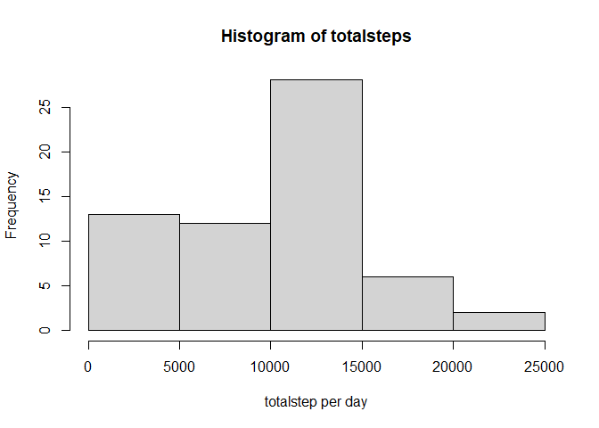
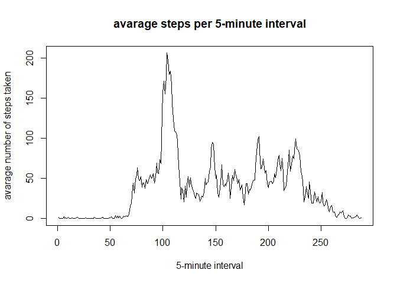
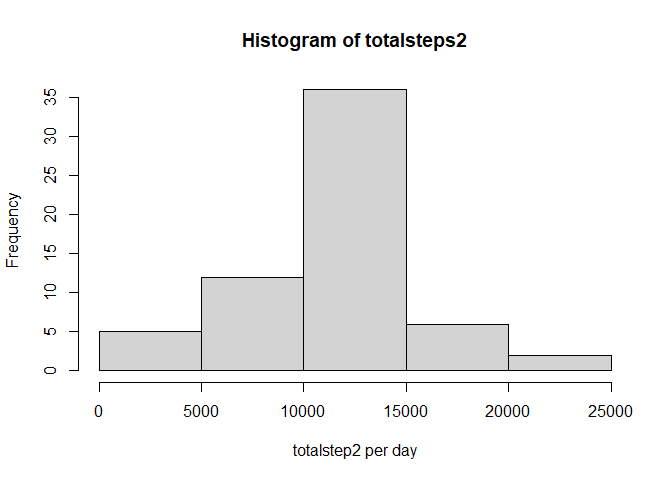
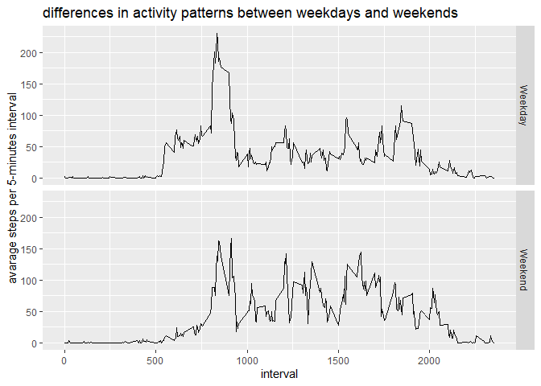

## Loading and preprocessing the data

```r
#unzip "activity.zip" and read csv file
    activity<-read.csv(unzip("activity.zip"))
#change the class of activity$date
    activity$date<-as.Date(activity$date)
```
## What is mean total number of steps taken per day?

```r
#calculate the total number of steps taken each day
totalsteps<-tapply(activity$steps,activity$date,sum,na.rm=TRUE)
#histogram of totalsteps
hist(totalsteps,xlab="totalstep per day")
```

<!-- -->

```r
#calculate the mean of the total number of steps taken per day
meansteps<-mean(totalsteps)
mediansteps<-median(totalsteps)
print(meansteps)
```

```
## [1] 9354.23
```

```r
print(mediansteps)
```

```
## [1] 10395
```
**meansteps is"9354.23"**

**mediansteps is "10395"**

## What is the average daily activity pattern?

```r
#calculate the avarage steps per each intervals
intsteps<-tapply(activity$steps,activity$interval,mean,na.rm=TRUE)
#plot "avarage steps per 5-minute interval
plot(intsteps,type="l",xlab="5-minute interval",ylab="avarage number of steps taken",main="avarage steps per 5-minute interval")
```

<!-- -->

```r
#print 5-minute interval which contains max steps
intsteps[intsteps==max(intsteps)]
```

```
##      835 
## 206.1698
```
**5-minute interval which contains max steps is "835"**

## Imputing missing values

```r
#calculate the total number of missing values in he dataset
table(is.na(activity$steps))
```

```
## 
## FALSE  TRUE 
## 15264  2304
```

**total row number of missing values is 2304** 


```r
#filling in all of the missing values in the dataset by using #the mean for that 5-minute interval

#convert the class of intsteps to data.frame
intsteps<-data.frame(interval=as.integer(rownames(intsteps)),avesteps=intsteps)

#filling NA by using the mean for that 5-minute interval
#filled value is in column named "step2"
for (i in 1:length(activity$steps)){
    if (is.na(activity$steps[i]==TRUE)) {
        activity$steps2[i]<-intsteps$avesteps[intsteps$interval==activity$interval[i]]
    }else{
        activity$steps2[i]<-activity$steps[i]
    }
}

#create new histogram by using revised dataset (activity$step2)
totalsteps2<-tapply(activity$steps2,activity$date,sum)
#histogram of totalsteps
hist(totalsteps2,xlab="totalstep2 per day")
```

<!-- -->

```r
#calculate the mean of the total number of steps taken per day

meansteps2<-mean(totalsteps2)
mediansteps2<-median(totalsteps2)
print(meansteps2)
```

```
## [1] 10766.19
```

```r
print(mediansteps2)
```

```
## [1] 10766.19
```
By imputing missing data on the estimates of the total daily number of steps, the mean of total number of steps increased
(This is because missing values are counted as "0" and decreased total/mean of daily steps)


## Are there differences in activity patterns between weekdays and weekends?

```r
#add column "days" by using function weekday() 
activity$days<-weekdays(activity$date)
#add column "days2" (which describe weekday or weekend)
for (i in 1:length(activity$days)){
    if (activity$days[i]=="Saturday"){
        activity$days2[i]<-"Weekend"
    }else if(activity$days[i]=="Sunday"){
        activity$days2[i]<-"Weekend"
    }else{
        activity$days2[i]<-"Weekday"
    }
}

#calculate the avarage steps per each intervals for weekday or Weekend 

intsteps2<-with(activity,(tapply(steps2,list(interval,days2),mean,na.rm=TRUE)))
intsteps2<-data.frame(interval=rep(rownames(intsteps2),2),steps=c(intsteps2[,1],intsteps2[,2]),weekday_end=rep(c("Weekday","Weekend"),each=288))

library(ggplot2)
```

```
## Warning: package 'ggplot2' was built under R version 4.0.2
```

```r
ggplot(data=intsteps2,aes(as.numeric(interval),steps))+geom_line()+facet_grid(
    factor(intsteps2$weekday_end)~.)+labs(title="differences in activity patterns between weekdays and weekends",x="interval",y="avarage steps per 5-minutes interval")
```

<!-- -->
